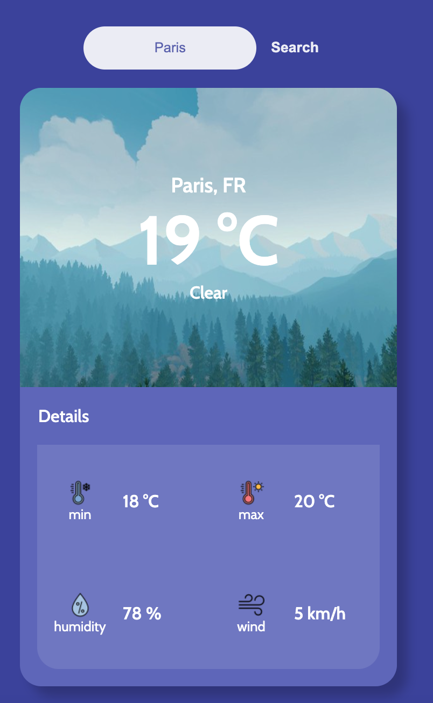

# Weather App :partly_sunny:  

Introduction to Angular and Typescript.  

### The mission:

Create a weather app that displays the temperature of a location with some details of the max. and min. temperature, humidity and wind speed.   

There is also a search input to search for the weather of other locations.  

**Framework used: Angular**  

**Weather API from [Open Weather Map](https://openweathermap.org/api)**

### Project deplyed via Netlify:
**https://bucolic-crepe-02c578.netlify.app/**

#### Preview:
